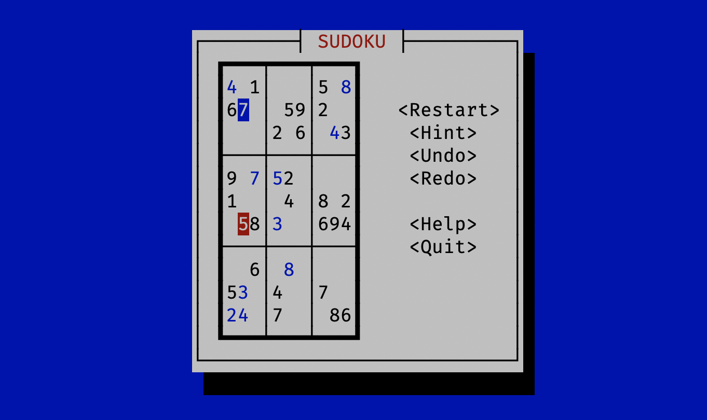

# sudoku-tui

Play sudoku on the command line.

# Installation

`cargo install sudoku-tui`

# Usage

Run `sudoku` to start game.

Use arrow keys/mouse wheel/mouse click to navigate. Enter the number 0-9 to fill in. Click `<Hint>` or press `<h>` to obtain a hint. `Ctrl/Cmd + Z` to undo (unfortunately, due to [technical limitations](https://github.com/gyscos/cursive/issues/516), `Ctrl/Cmd + Shift + Z` is not able to map to "redo", but there's a button for it).

# Compatibility

Works on Linux, MacOS and Windows, although you may be unable to use mouse actions on Windows.

# Roadmap

- [X] Basic logic
- [X] Display `You win`
- [X] Undo/Redo (`Ctrl + Shift + Z` binding not yet)
- [ ] Limit number of steps?
- [ ] Score calculation & difficulty selection
- [ ] history?
- [ ] time taken
- [ ] Hex